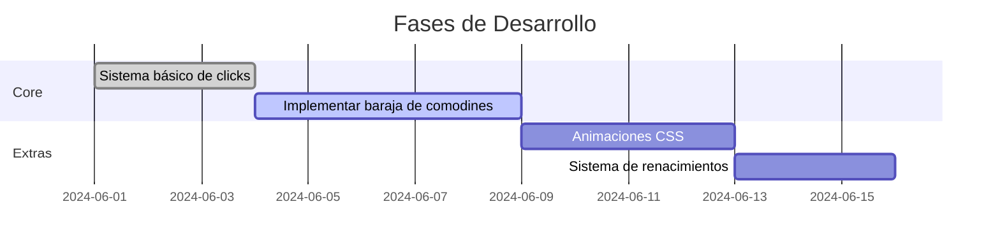

```markdown
# 🎴 Comodin Clicker | [](LICENSE)

 *(Reemplazar con GIF real)*  
*"Colecciona comodines estratégicos y domina el arte del clicking"*

## 🌟 Características Únicas
- **Sistema de baraja de comodines**: Equipa hasta 3 comodines (mejoras temporales) que potencian tus clicks.
- **Renacimientos prestigiosos**: Reinicia tu progreso por multiplicadores permanentes.
- **Logros secretos**: Desbloquea recompensas ocultas por patrones de clicks.
- **Animaciones temáticas**: Efectos visuales según el comodín activo (ej: explosión de cartas).

## 🛠️ Tecnologías
```diff
+ Frontend: HTML5, CSS3 (Animaciones con Keyframes), JavaScript ES6
+ Backend: localStorage (Progreso persistente)
+ Diseño: Figma (Prototipo interactivo)
+ Control de versiones: Git/GitHub (Forking workflow)
```

## 🎨 Temática y Diseño
**Tema principal**: **Juego de cartas/comodines**  
- Estilo visual: *Neón + Píxel Art* (fondos oscuros con cartas brillantes)  
- Sonidos: *Shuffles de cartas, chips de casino, fanfarrias al desbloquear logros*  

### ✨ Comodines confirmados:
| Comodín       | Efecto                  | Duración  | Slot Coste |
|---------------|-------------------------|-----------|------------|
| **Rey Corazón** | 2x multiplicador        | 30 seg    | 1 slot     |
| **Joker**     | Auto-click (5 clicks/s) | 15 seg    | 2 slots    |
| **As Picas**  | Click crítico (+10)     | 10 clicks | 1 slot     |

*(Prototipo en Figma: [Enlace al diseño](#))*  

## 📌 Roadmap del Proyecto


## 🧩 Cómo Contribuir
1. Haz fork del repositorio
2. Crea tu rama: `git checkout -b feature/nueva-mejora`
3. Sigue nuestra guía de estilos:
   ```javascript
   // Ejemplo de convención de código
   class Comodin {
     constructor(nombre, efecto) {
       this.nombre = nombre; // CamelCase para propiedades
       this.efecto = efecto;
     }
   }
   ```
4. Abre un Pull Request con etiqueta `enhancement`

## 📊 Estructura de Archivos
```
/src
|-- /assets
|   |-- /sounds    # Efectos de sonido (.mp3)
|   |-- /sprites   # Animaciones de cartas (.svg)
|-- /js
|   |-- comodines.js # Lógica de la baraja
|   |-- renacimientos.js
|-- index.html
|-- style.css      # Variables CSS (:root)
```

## 💾 Sistema de Guardado
```javascript
// Ejemplo de implementación
const guardarProgreso = () => {
  localStorage.setItem('baraja', JSON.stringify(barajaActiva));
  localStorage.setItem('multiplicadorGlobal', multiplicador);
};
```

## 🏆 Logros Planeados
| Logro               | Descripción                  | Recompensa       |
|---------------------|------------------------------|------------------|
| **Click Frenético** | 100 clicks en 10 segundos    | +1 slot de baraja|
| **Coleccionista**   | Equipar 5 comodines únicos   | Multiplicador x2 |

---

📌 **Nota para el equipo**:  
- Priorizar sistema de baraja antes de animaciones  
- Usar Issues de GitHub para dividir tareas  
- Reunión semanal los viernes para sincronizar progreso  
```

### 🔍 Elementos clave a destacar:
1. **Temática consistente**: Todas las mecánicas giran en torno a cartas/comodines.
2. **Documentación técnica clara**: Incluye ejemplos de código reales.
3. **Roadmap visual**: Usa Mermaid.js para mostrar el plan de desarrollo.
4. **Guía de contribución**: Esencial para trabajo en equipo.
5. **Tablas organizadas**: Para comodines y logros.